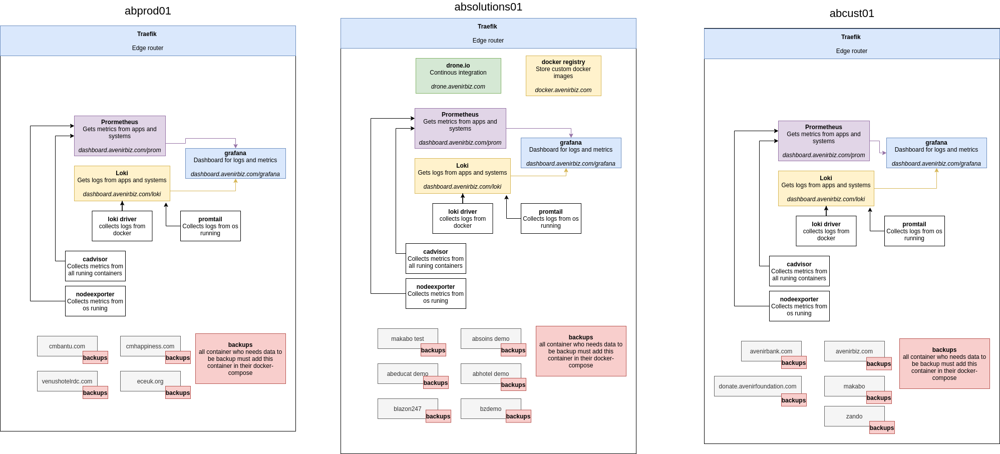

# Architecture with Docker before Kubernetes
This repo is documentation for how Avenir Business manages apps with Docker. We have :

* Dashboard ( Grafana + Loki + Prometheus + Alert manager ). (
[github.com/avenirbiz/docker_dashboard/](https://github.com/avenirbiz/docker_dashboard/) ).

* Odoo sample ( Odoo + Postgres + Adminer + futurice/volume-backup)
[github.com/avenirbiz/docker_odoo](https://github.com/avenirbiz/docker_odoo)

* Traefik as edge router [github.com/avenirbiz/docker_traefik](https://github.com/avenirbiz/docker_traefik)

* Absoins [github.com/avenirbiz/absoins](https://github.com/avenirbiz/absoins)

* Abhotel [github.com/avenirbiz/abhotel](https://github.com/avenirbiz/abhotel)

* ...
## Descriptions

Each project can contain:
* **sample.env** contains example of variables must be in .env file. As is not good to put credentials in Github* Alertmanager to send alert based on metrics trigger.
, variables in .env must come from password manager.
* **.env** contains variables and creditentials which must be set per project like domaine name, database password,...
* **Dockerfile** some project needs to be build to create docker image.
* **docker-compose.yml** contains configuration of running containers and traefik label for dynamic configuration
* **/etc/** contains configuration which must be insert inside running containers like odoo.conf ...
* **generate.py** Script to generate file like odoo.conf because in some case, configuration must be generated from ( .env or psono ) like odoo.conf,... like in Odoo, if database container run with database password from .env in docker-compose, the odoo.conf must have the same database password.
* **source code** we can have a custom Odoo module or another project source code. Every thing depends on Dockerfile or/and docker-compose.yml

You can see more description in each repo in README.md .

We use 3 setup : Dev mode, Test mode and Prod mod. But the test mode and prod mode are configured the same way. But in Test mode: the dk user must have permissions to run systemctl service, must have a ssh key and Github access, so drone CD/CI can use this user to get update from Github and restart container with update.

## Prod and Test mode
Can be setup in a local server ( Use Gogs and drone instead of Github ) or in a Cloud VPS...

* Install and Update OS. Choose a last LTS version of Ubuntu server

```bash
sudo apt update && sudo apt upgrade
```

* Install unattended-upgrades for automatically install security update
we can configure alert with alertmanager in github.com/avenirbiz/docker_dashboard

```bash
sudo apt install unattended-upgrades
# Uncomment security update only
sudo vim /etc/apt/apt.conf.d/50unattended-upgrades
"${distro_id}:${disto_codename}-security";
```

* Install security and tools

```bash
sudo apt install lynis rkhunter chkrootkit wireguard ufw fail2ban ssh-server

# We can create cron for those commands
sudo lynis audit system
sudo rkhunter --check
sudo chkrootkit
# Logs can be view if the dashboard is configured github.com/avenirbiz/docker_dashboard and alert too
```

## Configure the Docker environnement
Running Docker in production requires many security. The first and more important is to run only trusted image. Docker registry doesn't verify if a image contains malicious code or not.

1. Install docker and docker-compose in Linux. [Installation](https://docs.docker.com/engine/install/ubuntu/)
2. Create user docker. It's not recommended to run docker with a root user. If a process in Container run as root, so the process can access in the host as root. Before running a image in a production, we must verify in the Dockerfile, they use an none root user. You can use tool like hadolint to check Dockerfile

```bash
sudo useradd -r -m --shell /bin/bash -d /opt/dk dk
sudo usermod -aG docker dk # Add the user in docker group
```

Inside /opt/dk, we will put all project. Every project in will be a git project from Github.


3. To make every project inside /opt/dk running as a Systemd service, we must create a file /etc/systemd/system/dk@.service

```bash
[Unit]
Description=%i service with Docker-compose inside /opt/dk/i%
Requires=docker.service
After=docker.service

[Service]
Type=oneshot
RemainAfterExit=true
WorkingDirectory=/opt/dk/%i
ExectStart=/usr/docker-compose up -d
ExecStop=/usr/docker-compose stop
User=dk
Group=docker

[Install]
WantedBy=multi-user.target
```

```bash
# Reload systemd daemon
sudo systemctl daemon-reload
```

After that, every directory inside /opt/dk/, become a service and can be run by systemctl start dk@directory_name.service .

## Run container app
There is two way to run. One for developing and the other for production or testing

For developing, you need to add domaine manualy in /etc/hosts and create local certificat and configure traefik with dev config ( traefik-dev.yml ).

For production, certificat are auto generated with LetsEncrypt if the domaine point correctly to the server. It's our traefik default configuration ( traefik.yml )

#### Run traefik container. Traefik is entry point for all container application. It must be run before all other container. It listens the port 80 and 443, so those ports must be free.

```bash
# clone this repo from github and copy traefik directory to /opt/dk/
sudo -u dk git clone https://github.com/avenirbiz/docker_traefik /opt/dk/traefik
```

More about traefik, see in [github.com/avenirbiz/docker_traefik](https://github.com/avenirbiz/docker_traefik) and how to configure Traefik.

#### Start traefik container

```bash
sudo systemctl start dk@traefik.service
```

### Ansible: we can use Ansible to setup automatically the environment for Prod and Test
See script inside this repo
#### Run docker apps

Example, we want to run a Odoo app.

```bash
# Get the repo contains odoo docker-compose
sudo -u dk git clone https://github.com/avenirbiz/docker_odoo /opt/dk/avenirbiz
# See in docker_odoo/README.md how to configure
# After you can start avenirbiz
# You must be sure that traefik service run before
sudo systemctl start dk@avenirbiz
# You can open in browser the domaine name you have configure in your .env file
```

#### To see logs of running container
```bash
sudo docker ps -a # to see all containers
sudo docker logs -f container_name # If github.com/avenirbiz/docker_dashboard is configured, we can see logs in dashboard
```
NB:
The name of container is not necessary the name of systemd service. It's possible to stop or restart a service with docker commands. The systemd service run a docker-compose command in /opt/dk/**

### Configure a backup directory
Many docker-compose are configured to puts backups in /mnt/backups/ with the service github.com/futurice/docker-volume-backup . In developing, you can create the directory. In production, It can be a mounted NFS from storage backups.


## Develop Mode

You must run traefik. So we can follow the method above until before run traefik.
For certificat, we must generate manualy and change the config in docker-compose

#### Add your user in dk & docker groups to run without docker without sudo
```bash
# Will add your user in dk and docker groups
sudo usermod -aG dk $USER
sudo usermod -aG docker $USER
```
#### Create local SSL certificat for developing test with mkcert [download binary](https://github.com/FiloSottile/mkcert/releases)

```bash
sudo apt install libnss3-tools
# Exec the mkcert binary
./mkcert -install
# Add your local domaine name from /etc/hosts
# '*.localhost' means all domaine with .localhost will use this certificat
./mkcert -key-file key.pem -cert-file cert.pem '*.localhost' '*.test' localhost 127.0.0.1
```
#### copy the generated key to /opt/dk/traefik/etc/ssl

```bash
# copy key.pem cert.pem in /opt/dk/traefiK/etc/ssl
sudo -u dk mkdir /opt/dk/traefik/etc/ssl
sudo -u dk cp key.pem cert.pem /opt/dk/traefik/etc/ssl
```
#### in traefik docker-compose /opt/dk/traefik/docker-compose.yml, comment prod conf and uncomment dev conf
```yaml
      #- "./etc/traefik.yml:/traefik.yml:ro"
      - "./etc/traefik-dev.yml:/traefik.yml:ro" # Only for dev test
```
and restart dk@traefik

### Run container apps

Now you can clone app from github everywhere in your system ( even inside your home). Just configure the .env and run docker-compose up to run the container app.

N.B: Even in dev mode, the backup system works !


## How to migrate from odoo to odoo container

This is important to show how we can mount and copy file from container to system host and vice-versa. Even in server or local setup.

```bash
# This example for avenirbiz from odoo13 enterprise to odoo14 community

# Uncompress backup in home directory
tar zxvf bzovhapp02_enterprise_source-2021-02-05_1626.tgz
tar zxvf bzovhapp02_custom_source-2021-02-05_1625.tgz
tar zxvf avenirbank-filestore-2021-02-05_1545.tgz
gunzip avenirbank_com-2021-02-05_1612.sql.gz

# Clone an sample of docker_odoo
# Note that docker_odoo is just a sample. We can have a repo with custom modules or entreprise modules to facilate deployment. In this case, we go with a fresh docker_odoo repo.
sudo -u dk git clone https://github.com/avenirbiz/docker_odoo /opt/dk/avenirbiz

# copy custom & entreprise module
sudo -u dk cp -r enterprise custom community /opt/dk/avenirbiz/

cd /opt/dk/avenirbiz
# Configure the .env variable like addons_path, database name, admin_password and generate odoo.conf. Note that the .env and generate.py can be more complete with options later.

# Install python-dotvenv and run generate.py
python3 generate.py
```

```yaml

# Mount the directory where the backups are (home in our case) in Odoo and Postgres by adding volumes sections in docker-compose where Odoo field and Postgres field service is define.
services:
      odoo...
      volumes:
            - "/home/ivisi/:/tmp/backup"
      postgres...
      volumes:
            - "/home/ivisi/:/tmp/backup"
```
```bash
# Get into the Odoo and Postgres container and exec restore commands
# docker ps to see running container and get name
docker ps
# docker exec -ti TheContainerRunningName shell
docker exec -ti avenirbiz_com_db bash # restore db like usualy with pg_dump... from /tmp/backup
# Then exit and get into Odoo
docker exec -ti avenirbiz_com bash # restore filestore like usualy with cp... from /tmp/backup to /var/lib/odoo/.local/share...

# After that we can remove our volume fields we have added in docker-compose and rerun our service.
```


## Plan with Docker before Kubernetes


Each server runs [github.com/avenirbiz/docker_traefik](github.com/avenirbiz/docker_traefik), [github.com/avenirbiz/docker_dashboard](github.com/avenirbiz/docker_dashboard) ( Grafana, Prometheus, Loki, Promtail, Alertmanager, Cadvisor and nodeexporter )
### Server absolutions01
* Drone.io for CD/CI more info in [github.com/avenirbiz/docker_drone](github.com/avenirbiz/docker_drone) . Containers rerun with updated images every times we make a push in github.
* Docker-registry, tool for saving image. Is a private repository for customs docker images.
* makabo test
* abeducat demo
* absoins demo
* abhotel demo
* abfaith demo.
* backup container attached to all container volume need to be backups. We mount absolutions01 backup storage NFS in /mnt/backups. Then every backups will go there.

### Server abprod01
* cmbantu
* cmhappiness
* cmlerocher
* venushotelrdc
* eceuk.org
* backup container attached to all container volume need to be backups. We mount absolutions01 backup storage NFS in /mnt/backups. Then every backups will go there.

### Server abcust01
* avenirbank
* avenirbiz
* makabo ( Not ready )
* zando ( Not ready )
* donate.avenirbiz
* backup container attached to all container volume need to be backups. We mount absolutions01 backup storage NFS in /mnt/backups. Then every backups will go there.

## Next step: with Kubernetes
With Kubernetes, orchestration becomes simple and node can be add only when charge increases. But before we must study how it works and how it can resolve ours problems with docker architecture.

Problems with Docker:
* We manage and scales nodes and containers manually.
* Nodes are not connected each others. A instance of container can be run only in one node.
* Logs & metrics can be provide easy by Kubernetes