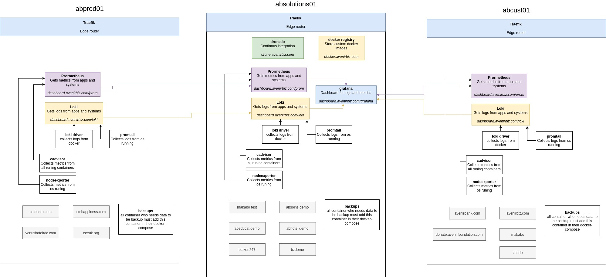

# Architecture with Docker before Kubernetes
This repo contains all docker-compose files ( without code source) for running apps we use. It can be run everywhere. Some images describe in docker-compose are private in our registry, so user must log (see docker-registry directory for more informations).

## List of docker-compose apps:

- alertmanager:
- bookstack
- cadvisor
- docker-registry
- grafana
- loki
- nodeexporter
- prometheus
- promtail
- traefik
- absoins
- absoins__lerocher
- abhotel
- abhotel__venus
- makabo
- zando
- abeducat

## Description of directory

Each directory contains:
* **sample.env** contains example of variables must be in .env file. As is not good to put credentials in Github, .env must be encrypted.
* **.env** contains variables and creditentials which must be set per projet like domaine name, database password,...
* **docker-compose.yml** contains configuration of running containers and traefik label for dynamic configuration
* **/etc/** contains configuration which must be insert inside running containers like odoo.conf ...
* **generate.py** In other case, some configuration must be generated automaticaly from ( .env or psono ) like odoo.conf,...

## Deploy apps in Linux OS

1. Install docker in Linux
2. Create user docker. It's not recommended to run docker with a root user.
3. Create a directory inside /etc where our docker-compose will be put. /etc/dkc/
4.

## Plan with Kubernetes before Kubernetes
